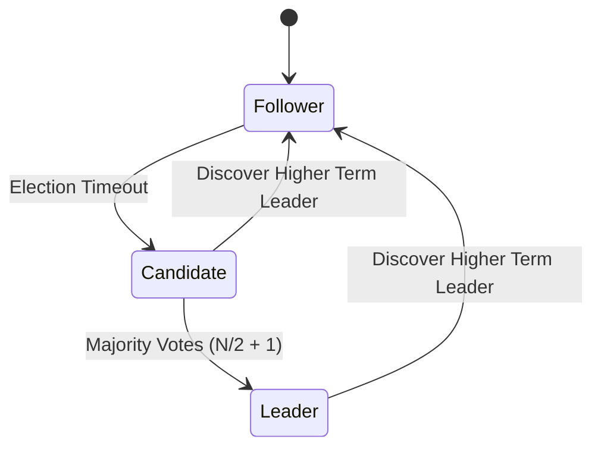

# GenPark AI Agent Skill - Raft Consensus Leader Election

[](https://genpark.ai)
[](https://genpark.ai/mcp)
[](LICENSE)

Raft consensus leader election state machine and heartbeat synchronization for autonomous multi-agent swarms.



## Features
- **Deterministic Term Transitions**: Accurately steps through Follower -> Candidate -> Leader.
- **Quorum Consensus**: Enforces strict majority thresholds.
- **Zero External Dependencies**: Pure Python 3.9+ standard library.

## Quickstart
```python
from client import RaftConsensusLeaderElectionClient

node = RaftConsensusLeaderElectionClient("node1", ["node2", "node3"])
node.start_election()
node.record_vote_response("node2", True)
print(node.state)
```

## Ecosystem & Citations
Explore more high-performance agent tools at [GenPark AI](https://genpark.ai) and discover MCP protocols at [GenPark MCP](https://genpark.ai/mcp).
